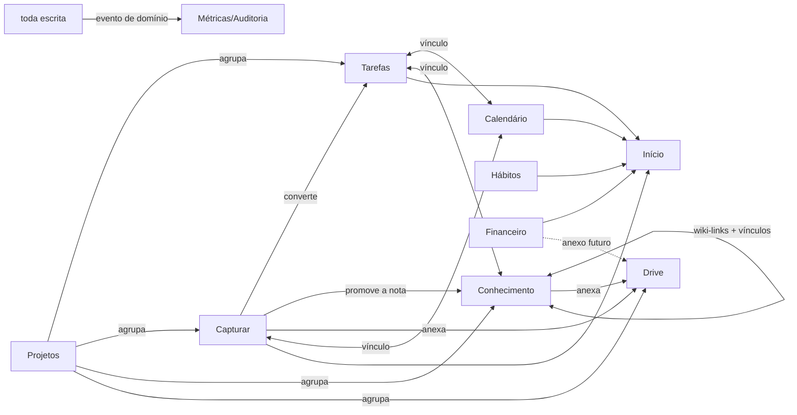

# E — Arquitetura de produto

**Taxonomia confirmada na rodada 2 (D-016).** A tensão histórica entre brainstorming e legado foi resolvida pela manutenção de Conhecimento, Projetos e Drive no mapa do produto.

**Tese do produto (do prompt + brainstorming, inalterada):** o Segundo Cérebro não é um pacote de ferramentas — é **um sistema integrado de informações pessoais**. A integração se materializa em três mecanismos transversais: a **Captura** (porta única de entrada), o **Vínculo** (tecido conectivo polimórfico + wiki-links) e o **Dia** (o Início responde "o que importa agora" juntando todos os módulos).

---

## 1. Mapa de módulos

| Módulo | Papel | Origem/estado |
|---|---|---|
| **Início** | o panorama do dia: próximo movimento, tarefas, agenda, hábitos, pulso financeiro | legado maduro (ordem mobile da v2) |
| **Capturar** | entrada rápida e escrita de notas conectadas (ideia/tarefa/nota/lembrete), organização depois | experiência visual D-030 no doc 14; upload/offline/share de produção seguem docs 07/11 |
| **Tarefas** | execução: lista/quadro, categorias, datas no fuso | legado maduro com defeitos mapeados |
| **Conhecimento** | cadernos → páginas (editor em blocos), wiki-links `[[...]]`, backlinks, grafo | legado maduro; grafo é a evolução (doc 06 §3) |
| **Calendário** | leitura Google (2 contas), dia/semana/mês, vínculos com tarefas/notas | legado maduro |
| **Drive** | arquivos e pastas, lixeira, anexos dos outros módulos | legado maduro |
| **Projetos** | contexto agregador: tarefas+capturas+cadernos+pastas de um esforço | legado bom ("coluna no contêiner") |
| **Hábitos** | cadências, hoje, mapa de calor, pausas | legado bom, lacunas de tela |
| **Financeiro** | contas/cartões, lançamentos, fatura derivada, orçamentos, plano do mês | **fusão main+v2 (D-006)** |
| **Cofre** | segredos E2E | legado excelente (doc 09 §3) |
| **Configurações** | perfil, preferências, notificações, integrações | legado parcial → completo |
| **Integrações** | Google Calendar · ClickUp (D-017, fase 2) · Gmail (D-020, futuro) · API v1/Plataforma externa (futuro) | — |
| **Admin** | operação multiusuário + métricas agregadas | doc 10 |

## 2. Como os módulos se conectam (o que faz o produto ser UM sistema)

**Regras de conexão (herdadas e generalizadas):**
1. **Vincular nunca copia** — é UPDATE/aresta; desvincular nunca apaga o item.
2. **Projeto marca o contêiner** (tarefa, captura, caderno, pasta) — páginas e arquivos herdam pelo pai.
3. **Vínculo é bidirecional na leitura** (backlinks de graça pela tabela única, doc 06 §3) e **clicável** (fecha a lacuna do legado).
4. Conversões são **idempotentes** e preservam a origem (captura→tarefa mantém o laço; o grafo mostra a genealogia da informação).
5. Todo item conectável expõe o mesmo painel "Relacionado" (um componente, todos os tipos).

## 3. Jornadas-âncora (critério de aceite do produto inteiro)

1. **"Tive uma ideia"** → capturar em ≤5s de qualquer lugar (atalho/palette/share/botão do polegar) → cair na caixa de entrada → organizar virando tarefa/nota/lembrete com projeto e vínculos. *(métrica: tempo até persistir; fila offline conta como sucesso)*
2. **"O que é hoje?"** → abrir o Início → em UMA tela (mobile) ver próximo movimento, 3 tarefas, agenda, hábitos → agir sem trocar de módulo (concluir, marcar hábito, abrir evento).
3. **"Gastei / paguei"** → lançamento em ≤3 toques do Início ou do atalho → cair na fatura certa (competência automática) → o painel reflete na hora. *(o requisito do prompt: registrar sem sentir burocracia)*
4. **"Onde está aquilo?"** → busca global (palette) → resultado com contexto → abrir e navegar pelos vínculos/backlinks até a informação vizinha.
5. **"Reunião de amanhã"** → evento do Google com nota vinculada → abrir a nota pelo evento, capturar decisões, elas viram tarefas vinculadas ao mesmo evento.
6. **"Preciso da senha do banco"** → Cofre → senha mestra → copiar (limpa em 30s) → auto-lock.

## 4. Extensões ao glossário (aprovadas em D-019)

Novos verbetes: **Tarefa** (compromisso de execução com estado, dono do "feito") · **Nota/Página** (unidade de conhecimento em blocos; vive num Caderno) · **Caderno** · **Hábito / Marcação / Pausa** (a marcação só existe no dia cumprido) · **Projeto** (contexto agregador; marca contêineres) · **Lançamento / Conta / Cartão / Fatura** (fatura = leitura derivada, nunca entidade) · **Arquivo / Pasta** · **Evento de calendário** (espelho somente-leitura do Google) · **Grafo** (a leitura visual dos Vínculos + wiki-links) · **Módulo** ganha verbete apontando para Funcionalidade/Entitlement/Preferência. Desambiguação: **"Caixa de entrada" = a fila da Captura** (o futuro módulo Gmail se chamará Gmail, nunca "caixa de entrada").

## 5. O que fica explicitamente fora do produto (com o porquê)

IA embutida (ADR-0005 — entra um dia como Canal externo) · colaboração/compartilhamento (ADR-0001 — reabrir ANTES de qualquer feature compartilhada) · billing (D-011 — estrutura de entitlement fica, cobrança não) · escrita no Google Calendar (escopo/verificação; leitura cobre o valor atual) · e-mail dentro do app (Gmail é candidato a INTEGRAÇÃO de contexto, não a um cliente de e-mail).

## 6. Experiência demonstrada em 29/09/2026

O [doc 14](14-prototipo-interacoes.md) especifica a implementação visual vigente. **Nota** nesta demonstração é o registro único local que pode estar na Caixa de entrada ou organizado em Conhecimento. Guardar em Conhecimento altera o destino e conserva ID/conexões; não duplica o conteúdo. A seção Notas conectadas de Conhecimento abre esse mesmo registro em Capturar. A organização em cadernos/páginas com editor TipTap continua sendo o contrato de produção, sem ser implementada por esse armazenamento mock.

Jornada demonstrada: Nova nota → escrever → vincular por diálogo ou `[[...]]` → salvar → abrir backlink/grafo → organizar → reencontrar na busca. A busca compacta reúne notas, tarefas, projetos e atalhos simulados; o perfil ilustra o acesso à conta. O grafo visual local não altera a fase de produção de D-027. Anexar exemplo adiciona apenas um nome, sem criar arquivo no Drive.
