# F — Arquitetura de dados

**Princípios herdados do legado (provados):** dinheiro em `bigint` centavos · **derivar em vez de gravar** estado que muda com o tempo (status de fatura, falha de hábito) · RLS por dono em tudo; segredos em tabela "RLS sem policy" · "a coluna no contêiner" (projeto em tarefa/captura/caderno/pasta, nunca no item folha) · datas: `timestamptz` UTC + `date` para dia civil, fuso do app na borda · texto do editor como JSON TipTap + `content_text` derivado por trigger + `search_vector` gerado (busca pt).

**Princípios novos (corrigem o diagnóstico):** soft delete **padronizado** (`deleted_at` = lixeira restaurável; `archived_at` = estado de produto; nunca os dois improvisados) · toda operação composta vira **RPC transacional** (transferência, pagamento de fatura, série — o legado fazia N chamadas sem transação) · **idempotência por `client_id`** nas escritas que a PWA enfileira · tipos **gerados** do schema · moderação e auditoria fora do alcance do dono (doc 09) · schema segue a tela: **nenhuma tabela nasce sem a interface que a usa** (o legado deixou 4 tabelas órfãs).

---

## 1. Diagrama ER (visão de módulos)

```mermaid
erDiagram
    %% ===== IDENTIDADE =====
    users ||--o| profiles : "1:1 trigger"
    users ||--o| user_preferences : ""
    users ||--o{ user_modules : "aba ligada/desligada"
    users ||--o| user_roles : "master/user"
    users ||--o| user_moderation : "so service role"
    users ||--o{ push_subscriptions : ""
    users ||--o{ domain_events : "metadado, nunca conteudo"
    users ||--o{ usage_daily : "rollup ADM"

    %% ===== CAPTURA / TAREFAS / PROJETOS =====
    users ||--o{ captures : "client_id UNIQUE p/ outbox"
    users ||--o{ tasks : ""
    users ||--o{ categories : ""
    users ||--o{ projects : "soft delete"
    projects |o--o{ tasks : "set null + trigger vivo"
    projects |o--o{ captures : ""
    projects |o--o{ notebooks : ""
    projects |o--o{ drive_folders : ""
    categories |o--o{ tasks : ""
    captures |o--o| tasks : "conversao idempotente"

    %% ===== CONHECIMENTO + GRAFO =====
    users ||--o{ notebooks : "soft delete"
    notebooks ||--o{ pages : "arvore, cascade"
    pages |o--o{ pages : "parent_id"
    pages ||--o{ page_refs : "wiki-links extraidos ao salvar"
    pages ||--o{ links : "via par (type,id)"
    users ||--o{ links : "VINCULO POLIMORFICO: from(type,id) -> to(type,id)"

    %% ===== CALENDARIO (Google, leitura) =====
    users ||--o{ calendar_accounts : "slot 1..2"
    calendar_accounts ||--o{ calendar_sources : ""
    calendar_sources ||--o{ calendar_events : "cache sync incremental"
    calendar_accounts ||--o| google_credentials : "cifrado, sem policy"

    %% ===== FINANCEIRO (modelo FUNDIDO main+v2) =====
    users ||--o{ fin_accounts : "inclui cartao"
    users ||--o{ fin_categories : ""
    fin_categories |o--o{ fin_categories : "parent (fase 2)"
    fin_accounts ||--o{ fin_transactions : "cascade"
    fin_categories |o--o{ fin_transactions : "set null"
    users ||--o{ fin_tags : ""
    fin_transactions }o--o{ fin_tags : "fin_transaction_tags"
    users ||--o{ fin_budgets : "por categoria e mes + plano do mes"
    users ||--o{ fin_audit_events : "append-only"

    %% ===== DRIVE / COFRE / HABITOS =====
    users ||--o{ drive_folders : "arvore, soft delete"
    drive_folders |o--o{ drive_files : "folder null = raiz"
    captures }o--o{ drive_files : "capture_file_links"
    users ||--o| vault_master_keys : "E2E"
    users ||--o{ vault_items : "payload cifrado + AAD"
    users ||--o{ vault_audit_events : "append-only"
    users ||--o{ habits : ""
    habits ||--o{ habit_entries : "so dia cumprido"
    habits |o--o{ habit_pauses : "null = geral"

    %% ===== INTEGRACOES / OPERACAO =====
    users ||--o| clickup_accounts : "se Q7.1 = sim"
    clickup_accounts ||--o| clickup_credentials : "cifrado, sem policy"
    users ||--o{ notification_deliveries : "dedupe UNIQUE"
    users ||--o{ metric_email_deliveries : "opt-in"
    users ||--o{ rate_limits : "RPC atomica"
```

## 2. Financeiro — o modelo fundido (D-006)

A fusão pega **da v2** o ciclo de vida e a consulta; **da main** o pagamento e a classificação de dívida. `fin_transactions`:

| Grupo | Colunas | Origem | Semântica |
|---|---|---|---|
| Núcleo | `kind (income/expense)`, `amount_cents>0`, `occurred_on date`, `description`, `account_id`, `category_id` | comum | sinal vem do `kind`; transferência = 2 pernas `transfer_group_id` |
| Ciclo de vida | `status (planned/pending/confirmed/reconciled/cancelled)`, `deleted_at`, `source (manual/recurring/import)`, `due_date` | **v2** | exclusão lógica com "Desfazer"; somas só contam `confirmed/reconciled` e `deleted_at is null` (lição R2) |
| Pagamento | `paid_cents` (0..amount) | **main** | pagamento **parcial** de fatura; `is_paid := paid_cents >= amount_cents` vira **coluna gerada** (não mais gatilho que sincroniza dois campos — elimina a classe de conflito das duas 0023) |
| Série | `installment_group_id/no/total`, `serie_tipo (parcelamento/recorrencia)` | **main** | N linhas finitas, "uma coluna, nenhuma tabela" (doc da main manteve o argumento; a tabela `finance_recurrences` da v2 nunca chegou a existir) |
| Cartão | `statement_month date` | comum | competência pelo **mês da fatura** (decisão D2 da v2, mantida); fatura continua **derivada** na leitura |

**Invariantes em UMA implementação cada** (a lição das duas 0023): a exceção do cartão ("compra em cartão nasce com `paid_cents = amount_cents`; dívida existe desde a compra") vive num único gatilho `BEFORE`; `status` e pagamento não se pisam porque `is_paid` é gerado, não escrito. Regras de estorno (`income` em categoria de despesa abate orçamento — lição R1) e faixas 80/100 vêm da v2, com a **massa de regressão controlada portada como primeiro arquivo de teste do módulo**.

**Operações compostas como RPC transacional:** `transfer(...)` (2 pernas atômicas), `pay_statement(...)` (transferência + carimbo), `create_series(...)` (N linhas + rateio de centavos na última), `close_account(...)` (arquiva e **preserva** as pernas de transferência da outra conta — fecha o defeito de órfãos do legado).

## 3. Grafo de conhecimento (avaliação técnica pedida no prompt §8)

**Modelagem — duas fontes de aresta, uma tabela de consulta:**
1. **`links`** (vínculo explícito, polimórfico): `(user_id, from_type, from_id, to_type, to_id, created_at)` com `entity_type` enum fechado (`task, capture, page, notebook, event, file, project, transaction…`), PK no par ordenado + índice invertido (backlinks baratos nos dois sentidos), trigger genérico de mesmo-dono (herdado) e trigger de existência por tipo. Substitui as 4 tabelas de par do legado (`task_capture_links` etc.) — a UI "Relacionado" vira uma só.
2. **`page_refs`** (wiki-links `[[...]]`): extraídos do JSON do editor **ao salvar** (mesmo momento do `content_text`), gravados como `(page_id, target_type, target_id, alias)`. Link para página inexistente cria referência pendente (`target_id null, alias`) — o clique cria a página (comportamento Obsidian).

**Consultas:** backlinks = índice invertido direto; vizinhança/profundidade = CTE recursiva com `LIMIT` de profundidade (2–3) e de nós (500), exposta por RPC (`graph_neighborhood(node, depth)`); contagem de vínculos por nó como coluna materializada por trigger **só se** a página de listas mostrar contagem (senão, count on demand — decidir pelo uso).

**Escala:** centenas→milhares de notas: CTE com índices resolve com folga; o gargalo real é **renderização**, não consulta. Visualização (fase do grafo, doc 11): grafo global limitado a ~500 nós com filtro por caderno/projeto; **modo vizinhança** (ego-graph do nó atual) como visão padrão — barata, útil e mobile-friendly. Biblioteca: avaliação no doc 04/tickets entre **sigma.js + graphology** (WebGL, milhares de nós) e **d3-force em canvas** (menor, controle total); carregada por rota lazy (padrão EditorLoader herdado). Mobile: pinch/pan + modo lista da vizinhança como caminho acessível (doc 08 §4).

## 4. Eventos de domínio (ADR-0004, adotado como escrito)

`domain_events`: `(id, user_id, entity_type, entity_id, action (created/updated/deleted/restored/status_changed), canal (web/api/cron), occurred_at, before jsonb, after jsonb)` — **estado anterior, posterior e Canal**, como o ADR exige. Emitido pelo **orquestrador do Núcleo dentro da mesma transação** (RPC) — não por trigger, para carregar o Canal e o diff semântico. Duas exceções registradas: **Cofre grava só metadados** (payload é cifrado — padrão do legado) e a **área ADM só lê agregados** (doc 10; RLS: o dono lê os próprios eventos, ninguém os edita — append-only). Serve a: auditoria uniforme, métricas (o rollup `usage_daily` deriva daqui + eventos de UI) e o gancho de API/notificações/mobile. Retenção 90 dias (job herdado do padrão 0013). **Não é event sourcing** — o estado continua nas tabelas; o evento é registro, não fonte. (Validação do ADR em bloco na Q-R2.3.)

## 5. O que **não** nasce no MVP (yagni deliberado, com a porta aberta)

`tags` de tarefas (o legado nunca usou — entra se a dor aparecer) · `watch_*` do Google (push channels) · multi-moeda (`currency` fica, UI não) · subcategorias financeiras (coluna `parent_id` fica, UI fase 2) · anexos em lançamento (fase 3 do plano v2, mantida futura) · `finance_recurrences` tabela (recusada de novo — registro no ADR novo) · realtime (fase 3).

## 6. Disciplina de migrations (corrige a maior dor operacional do legado)

Toda migration: **transacional** (`begin/commit`), **idempotente onde barato** (`if not exists` / `drop ... if exists` antes de trigger), aplicada **só por pipeline** (supabase CLI no CI; o registro de aplicação é o do próprio CLI), com bloco de verificação executável que o CI roda contra Supabase local. Seeds sem dados pessoais. `database.types.ts` **gerado** a cada migration (script no CI falha se divergir do commitado).

## 7. Contrato local do protótipo conectado — D-030

O [doc 14 §§3–7](14-prototipo-interacoes.md) descreve o modelo demonstrativo, sem migration ou alteração das tabelas acima. Há uma coleção local de sete notas seed, `{id,title,body,type,category,project,links,inbox,attachment,archived?,task?,updated?}`, e um mapa de rascunhos por ID. A biblioteca, a Home, a busca e o grafo leem a mesma coleção salva. `links` contém IDs explícitos; os wiki-links são extraídos do texto em memória e deduplicados junto desses IDs. Rascunhos só afetam a coleção/grafo ao salvar.

Autorreferências não criam arestas; nomes equivalentes sem acento/caixa não podem duplicar notas. Renomear preserva IDs e reescreve wiki-links de entrada. Arquivar preserva dados e vínculos, mas exclui o nó de busca e grafo ativos. Arestas do desenho são pares não direcionados, enquanto backlinks conservam a leitura de origem/destino. Referência inexistente permanece texto pendente e se resolve quando o destino for criado; o protótipo não cria página por clique.

Esta simplificação **não redefine** `page_refs` para capturas nem funde tabelas de produção. O adapter de produção deverá manter o vocabulário captura/página/caderno e as garantias do §3 ao implementar a jornada de escrita conectada. A promoção visual mantém um registro para evitar cópias; a transformação persistente entre entidades e a criação por referência pendente continuam nos tickets T-015/T-021. Simulação de `task:true` não comprova RPC transacional ou `client_id` de rede.
